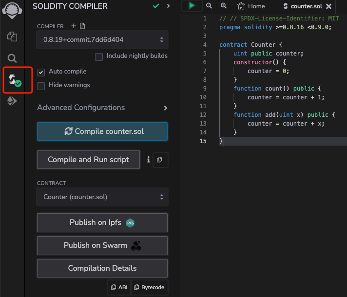
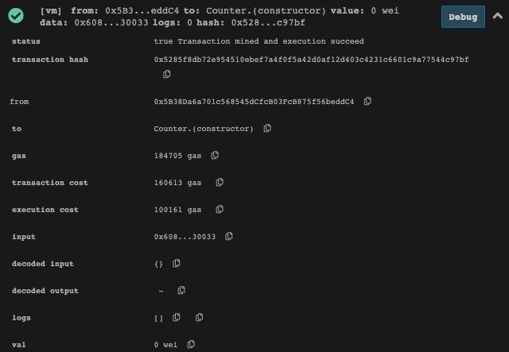
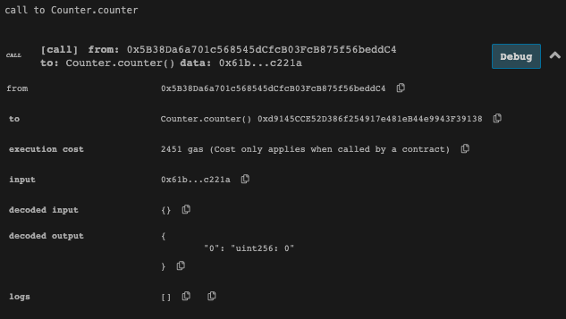
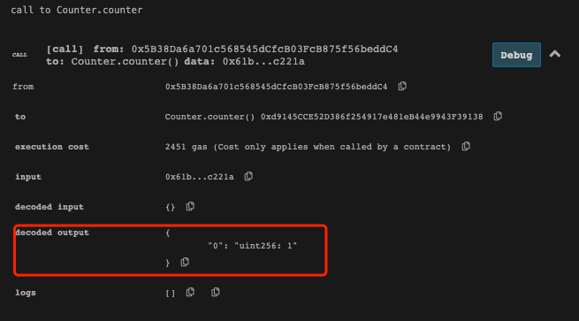
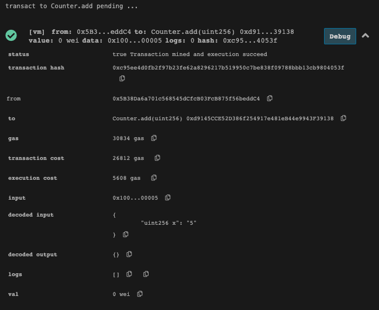
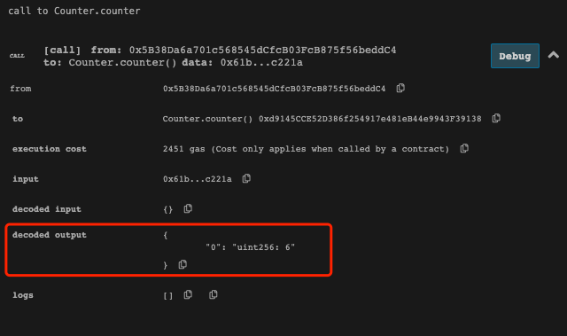

# 1.使用MetaMask转账

安装metamask：

转账：from：0xE0c..89A6 to：0xbbd...3EDf

交易hash：0xd2a7b60ec5e34bd8b9d9d7917cb0ea240c138e67a8d2268ee8400fa19d7e28ac

# 2.通过remix编写counter.sol合约实现部署和add(x) 功能

## 编译

## 部署

检查counter值：

调用一次count方法：

再次检查counter的值：

调用add方法，传入参数5：

三次检查counter的值：

