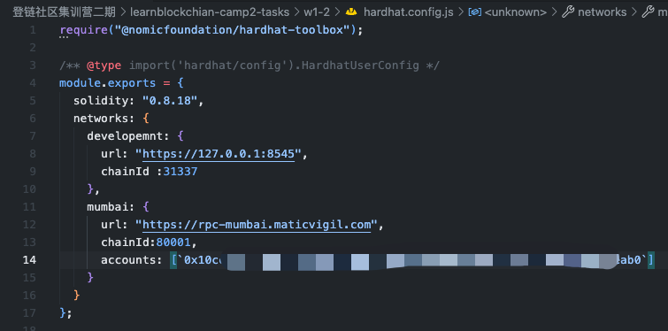
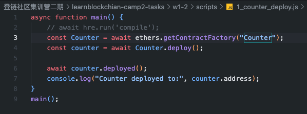
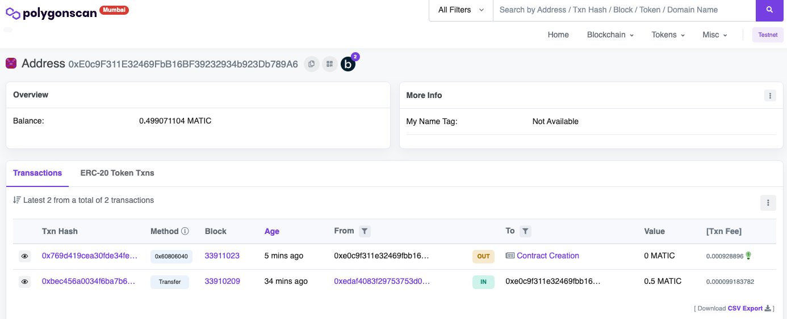
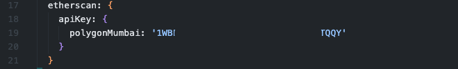

W1-2作业


### 部署合约

代码修改至counter1-2.sol

使用hardhat部署counter1-2.sol

1. 配置网络
   注意：部署到mumbai需要测试网账户私钥

   
2. 编写部署脚本

   
3. 启动本地网络

   `npx hardhat node`
4. 执行部署到本地

   ```
   npx hardhat run ./scripts/1_counter_deploy.js
   ```
   输出结果：

   ```
   MBP14:w1-2 reporterha$ npx hardhat compile
   Compiled 2 Solidity files successfully
   MBP14:w1-2 reporterha$ npx hardhat run ./scripts/1_counter_deploy.js 
   Counter deployed to: 0x5FbDB2315678afecb367f032d93F642f64180aa3
   ```
   部署到mumbai：

   ```
   MBP14:w1-2 reporterha$ npx hardhat --network mumbai run ./scripts/1_counter_deploy.js 
   Counter deployed to:0xF4E034BC6E774803509d3F6Aecb7610b51AD06BD
   ```
   
5. 代码验证，公开到浏览器：

   ```
   MBP14:w1-2 reporterha$ npx hardhat --network mumbai verify --contract "contracts/counter1-2.sol:Counter" 0xF4E034BC6E774803509d3F6Aecb7610b51AD06BD
   Nothing to compile
   Successfully submitted source code for contract
   contracts/counter1-2.sol:Counter at 0xF4E034BC6E774803509d3F6Aecb7610b51AD06BD
   for verification on the block explorer. Waiting for verification result...

   Successfully verified contract Counter on Etherscan.
   https://mumbai.polygonscan.com/address/0xF4E034BC6E774803509d3F6Aecb7610b51AD06BD#code
   ```
   注意：需要在hardhat.config.js中配置[polyogn浏览器API](https://polygonscan.com/myapikey)：

   
6. 导出hardhat api

   ```

   //  1.安装exporter
   npm install --save-dev hardhat-api-exporter

   //  2.添加到hardhat.config.js中
   require("hardhat-abi-exporter");

   //  3.配置export ABI：
   abiExporter: {
       path: './deployments/abi',
       clear: true,
       flat: true,
       only: [],
       spacing: 2,
       pretty: true,
     }

   //  4.导出ABI
   npx hardhat export-abi

   //  5.清除ABI
   npx hardhat clear-abi
   ```
7. 测试counter

   GPT帮我生成的：

   ethers.getSinger() 会顺序返回hardhat节点的账户列表数组，所以你的数组中有几个参数就会返回多少账户对象；

   ```
   MBP14:w1-2 reporterha$ npx hardhat test


     Counter
       ✔ Should return the initial counter value of zero
       ✔ Should increase the counter value by one when using count()
       ✔ Should add a given value to the counter value when using add()
       1) Should only allow the deployer to use count()


     3 passing (791ms)
     1 failing

     1) Counter
          Should only allow the deployer to use count():
        AssertionError: Expected transaction to be reverted with reason 'Only the contract depoyer can perform this action', but it didn't revert
         at processTicksAndRejections (node:internal/process/task_queues:96:5)
         at Context.<anonymous> (test/counter.js:35:5)

   ```
   如果使用deployer去调用 count 不会造成revert，这样revertedWith()函数没有被满足 反而会造成报错；
