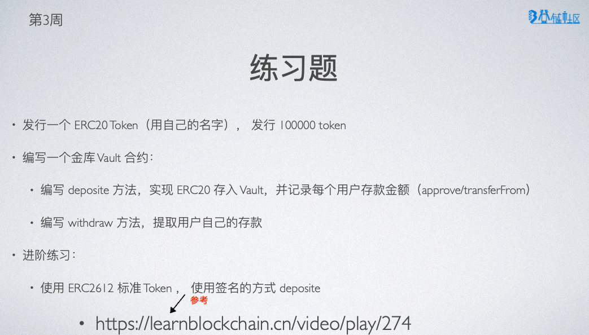

# W3-1

我发现实践的时候要做好文档，还是大有好处的：

第一个问题：

## You

解释一下ERC20的transferFrom方法

## Genie

`transferFrom`是ERC20代币合约中的一个方法，它允许一个已获得批准授权的地址将其余额从另一个地址上转移到第三方地址。

其中需要传入三个参数:

1.`_from`: 要转移代币的地址**(其实就是代币的真正所有者也就是account1)**。

2.`_to`: 接收代币的地址(可以是任意地址)。

3.`_value`: 要转移的代币数量。

使用该方法前，**必须先调用 `approve`函数来授权某一地址可以从你的账户上转移一定数量的代币**。在成功调用 `approve`授权之后，被授权者就可以通过调用 `transferFrom`方法来实际进行代币转移。

「我将第一个账户中100个代币授权给第二个账户，随后切换到第二个账户开始调用transferFrom函数从from(~~第二个账户~~)转给to(第一个账户)，100个代币 但是不成功」。

如果调用该方法的地址不是**被授权者**（第二个账户）或者授权额度小于转移额度，则会抛出错误并取消交易。from必须是代币的的所有者。

简单来讲，调用transferFrom的账户被from授权了一定的代币操作权，将from中amount数量的代币转移给to。
