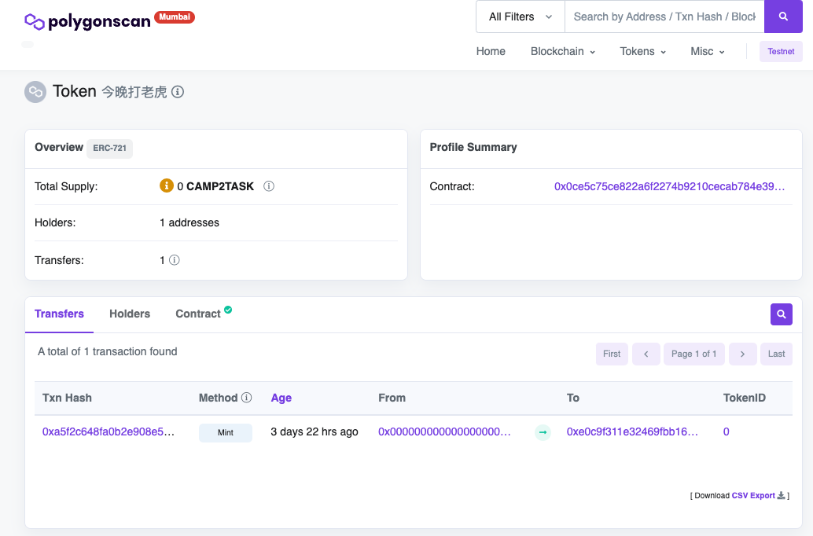
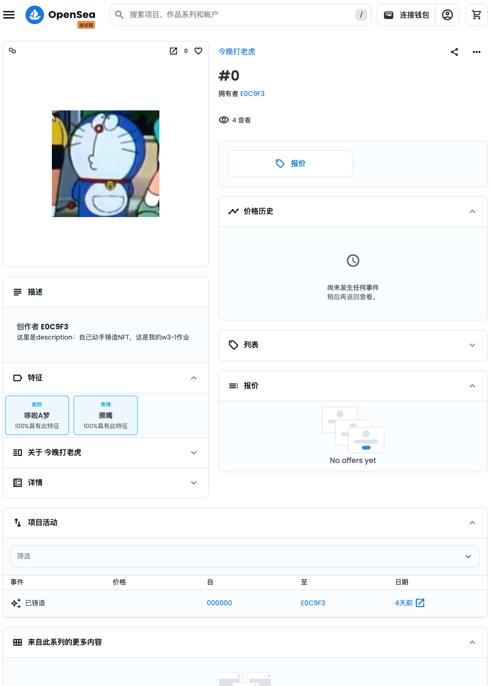
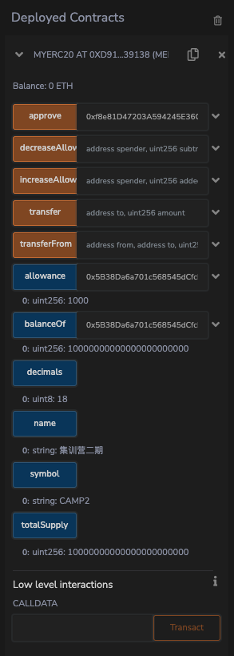
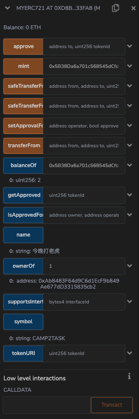

1. ## 先部署（remix），后续再通过Foundry命令验证：

   ```
   forge verify-contract \
       --chain-id 80001 \
       --num-of-optimizations 200 \
       --watch \
       --etherscan-api-key 1WBEBRGY6RSS4NYX9INIK8E8E57PSSTQQY \
      0x2633946Fafe6999dFaBD2729408E94CC1149B86F \
       src/MyERC721.sol:MyERC721

   Submitted contract for verification:
                   Response: `OK`
                   GUID: `a6yrbjp5prvakia6bqp5qdacczyfhkyi5j1r6qbds1js41ak1a`
                   url: https://sepolia.etherscan.io//address/0x6a54…3a4c#code

   ```

验证一直不通过，放弃了。

## 试试一键部署加验证：

```
forge create --rpc-url mumbai \
    --private-key 10ccce74f9893ff3bed704f116f73e6d75dcd02ac22259d68c9525d240d1eab0 \
    --etherscan-api-key 1WBEBRGY6RSS4NYX9INIK8E8E57PSSTQQY \
    --verify \
    src/MyERC721.sol:MyERC721

```

输出如下：

```
Deployer: 0xE0c9F311E32469FbB16BF39232934b923Db789A6
Deployed to: 0x6742D4A694dc9b9a341FC64bd72fc8f0F248905A
Transaction hash: 0xfaf1b7f4c2ab7fab226cd42e74cc52f17b80b207e6c1e052921a1a7cbd6a5959
Starting contract verification...
Waiting for etherscan to detect contract deployment...
Start verifying contract `0x6742d4a694dc9b9a341fc64bd72fc8f0f248905a` deployed on mumbai

Submitting verification for [src/MyERC721.sol:MyERC721] "0x6742D4A694dc9b9a341FC64bd72fc8f0F248905A".

Submitting verification for [src/MyERC721.sol:MyERC721] "0x6742D4A694dc9b9a341FC64bd72fc8f0F248905A".
Submitted contract for verification:
	Response: `OK`
	GUID: `a9yp8lmuuspmwfqqvqdvkw53ec3jhprczfeqnijftc2g9wkpnm`
	URL:
        https://mumbai.polygonscan.com/address/0x6742d4a694dc9b9a341fc64bd72fc8f0f248905a
Contract verification status:
Response: `NOTOK`
Details: `Pending in queue`
Contract verification status:
Response: `OK`
Details: `Pass - Verified`
Contract successfully verified

```

有个问题是src下所有的文件都会被编译，在remixd中导入OZ的方式 `@openzeppelin`都会报错，应当全部使用 `openzeppelin-contracts`代替；

## 练习题

1. 发行一个 ERC721Token(用自己的名字：今晚打老虎)`https://mumbai.polygonscan.com/address/0x0ce5c75ce822a6f2274b9210cecab784e3930864`
2. 铸造 一个 NFT，在测试网上发行，在 Opensea 上查看
   ERC721合约部署之后，要mint新的nft需要重新上传新的ipfs文件内容，而metadata中的json文件在部署合约的时候是用不到的，只有mintNFT之前需要上传到ipfs中已获得一个链接作为mint的参数。
   铸造地址：https://mumbai.polygonscan.com/token/0x0ce5c75ce822a6f2274b9210cecab784e3930864
3. Opensea查看：https://testnets.opensea.io/zh-CN/assets/mumbai/0x0ce5c75ce822a6f2274b9210cecab784e3930864/0

   
4. 编写一个合约:使用自己发行的ERC20 Token 来买卖NFT

   * NFT 持有者可上架 NFT(list 设置价格 多少个 TOKEN 购买 NFT )
   * 编写购买NFT 方法，转入对应的TOKEN，获取对应的 NFT


1.部署ERC20代币合约生成 `10000 * 10**18` 个代币保存在合约部署者地址下；

2.给NFTMarket合约（0xf8e81D47203A594245E36C48e151709F0C19fBe8）授权了1000个代币；



3.在MyERC721中mintNFT分别属于（0x5B38Da6a701c568545dCfcB03FcB875f56beddC4（2个），0xAb8483F64d9C6d1EcF9b849Ae677dD3315835cb2（1个））：



mint:指定mint对象归属地址，和tokenURI字符串；

balanceOf(address):此地址下NFT数量；

ownerOf(tokenID):通过NFT的tokenID查询其所有者；
