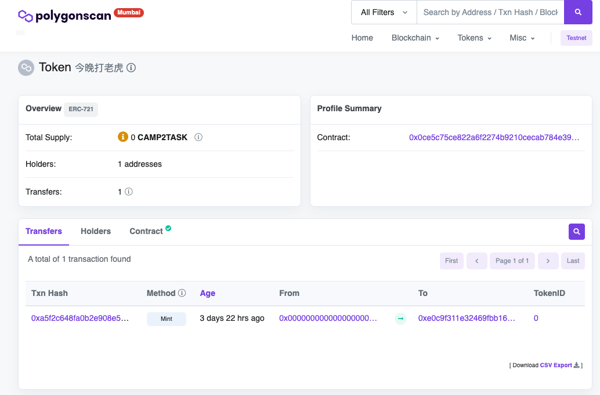
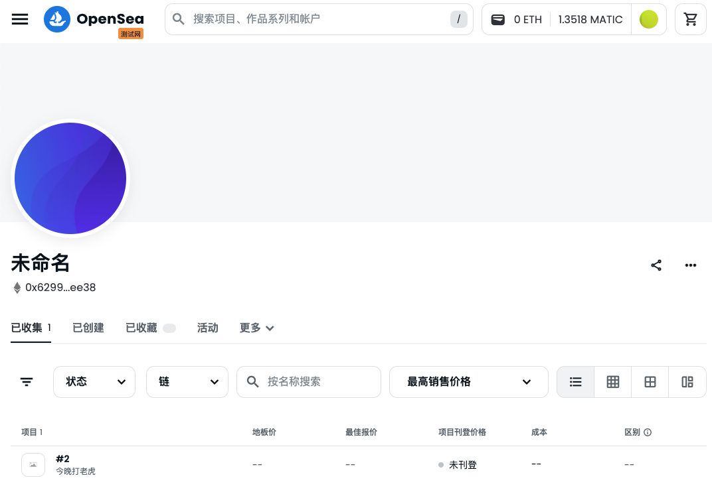

1. ## 先部署（remix），后续再通过Foundry命令验证：

   ```
   forge verify-contract \
       --chain-id 80001 \
       --num-of-optimizations 200 \
       --watch \
       --etherscan-api-key 1WBEBRGY6RSS4NYX9INIK8E8E57PSSTQQY \
      0x2633946Fafe6999dFaBD2729408E94CC1149B86F \
       src/MyERC721.sol:MyERC721

   Submitted contract for verification:
                   Response: `OK`
                   GUID: `a6yrbjp5prvakia6bqp5qdacczyfhkyi5j1r6qbds1js41ak1a`
                   url: https://sepolia.etherscan.io//address/0x6a54…3a4c#code

   ```

验证一直不通过，放弃了。

## 试试一键部署加验证：

```
forge create --rpc-url mumbai \
    --private-key <your_private_key> \
    --etherscan-api-key 1WBEBRGY6RSS4NYX9INIK8E8E57PSSTQQY \
    --verify \
    src/MyERC721.sol:MyERC721

```

输出如下：

```
Deployer: 0xE0c9F311E32469FbB16BF39232934b923Db789A6
Deployed to: 0x6742D4A694dc9b9a341FC64bd72fc8f0F248905A
Transaction hash: 0xfaf1b7f4c2ab7fab226cd42e74cc52f17b80b207e6c1e052921a1a7cbd6a5959
Starting contract verification...
Waiting for etherscan to detect contract deployment...
Start verifying contract `0x6742d4a694dc9b9a341fc64bd72fc8f0f248905a` deployed on mumbai

Submitting verification for [src/MyERC721.sol:MyERC721] "0x6742D4A694dc9b9a341FC64bd72fc8f0F248905A".

Submitting verification for [src/MyERC721.sol:MyERC721] "0x6742D4A694dc9b9a341FC64bd72fc8f0F248905A".
Submitted contract for verification:
	Response: `OK`
	GUID: `a9yp8lmuuspmwfqqvqdvkw53ec3jhprczfeqnijftc2g9wkpnm`
	URL:
        https://mumbai.polygonscan.com/address/0x6742d4a694dc9b9a341fc64bd72fc8f0f248905a
Contract verification status:
Response: `NOTOK`
Details: `Pending in queue`
Contract verification status:
Response: `OK`
Details: `Pass - Verified`
Contract successfully verified

```

有个问题是src下所有的文件都会被编译，在remixd中导入OZ的方式 `@openzeppelin`都会报错，应当全部使用 `openzeppelin-contracts`代替；

## 练习题

1. 发行一个 ERC721Token(用自己的名字：今晚打老虎)`https://mumbai.polygonscan.com/address/0x0ce5c75ce822a6f2274b9210cecab784e3930864`
2. 铸造 一个 NFT，在测试网上发行，在 Opensea 上查看
   ERC721合约部署之后，要mint新的nft需要重新上传新的ipfs文件内容，而metadata中的json文件在部署合约的时候是用不到的，只有mintNFT之前需要上传到ipfs中已获得一个链接作为mint的参数。
   铸造地址：https://mumbai.polygonscan.com/token/0x0ce5c75ce822a6f2274b9210cecab784e3930864
3. Opensea查看：https://testnets.opensea.io/zh-CN/assets/mumbai/0x0ce5c75ce822a6f2274b9210cecab784e3930864/0

   
4. 编写一个合约:使用自己发行的ERC20 Token 来买卖NFT

   * NFT 持有者可上架 NFT(list 设置价格 多少个 TOKEN 购买 NFT )
   * 编写购买NFT 方法，转入对应的TOKEN，获取对应的 NFT

1.部署ERC20代币合约生成 `10000 * 10**18` 个代币保存在合约部署者地址下；

```
forge create --rpc-url mumbai \
    --private-key <your_private_key> \
    --etherscan-api-key 1WBEBRGY6RSS4NYX9INIK8E8E57PSSTQQY \
    --verify \
    src/MyToken.sol:MyERC20
```

部署结果输出：

```
Deployer: 0xE0c9F311E32469FbB16BF39232934b923Db789A6
Deployed to: 0x7B1Dfbb892ad5dfd4eEFF789baEE41357FbA0188
Transaction hash: 0x54bdf0fc9e740f6d555b3240415b04454d55a88b63f6a0124dc3ea59a95cc767
Starting contract verification...
Waiting for etherscan to detect contract deployment...
Start verifying contract `0x7b1dfbb892ad5dfd4eeff789baee41357fba0188` deployed on mumbai

Submitting verification for [src/MyToken.sol:MyERC20] "0x7B1Dfbb892ad5dfd4eEFF789baEE41357FbA0188".

Submitting verification for [src/MyToken.sol:MyERC20] "0x7B1Dfbb892ad5dfd4eEFF789baEE41357FbA0188".

Submitting verification for [src/MyToken.sol:MyERC20] "0x7B1Dfbb892ad5dfd4eEFF789baEE41357FbA0188".
Submitted contract for verification:
	Response: `OK`
	GUID: `ttcucgunedh1wqhmhfa8jtzg4vy9uaxk4wuxatvcterkxavqjg`
	URL:
        https://mumbai.polygonscan.com/address/0x7b1dfbb892ad5dfd4eeff789baee41357fba0188
Contract verification status:
Response: `NOTOK`
Details: `Pending in queue`
Contract verification status:
Response: `OK`
Details: `Pass - Verified`
Contract successfully verified
```

2.部署MyERC721.sol

不用部署了，用上面已经成功部署的那个；

3.部署NFTMarket.sol

`--constructor-args  `指定两个参数，一个是ERC20代币合约地址，另一个是ERC721合约地址；

```
forge create --rpc-url mumbai \
    --constructor-args 0x7B1Dfbb892ad5dfd4eEFF789baEE41357FbA0188 0x0CE5c75CE822A6f2274B9210cEcAb784E3930864 \
    --private-key <your_private_key> \
    --etherscan-api-key 1WBEBRGY6RSS4NYX9INIK8E8E57PSSTQQY \
    --verify \
    src/NFTMarket.sol:NFTMarket
```

部署结果输出：

```
[⠒] Compiling...
No files changed, compilation skipped
Deployer: 0xE0c9F311E32469FbB16BF39232934b923Db789A6
Deployed to: 0x6299CF47d1ADF683CEe5bDc885cEd0FF46C1ee38
Transaction hash: 0xdf21c40ae717310d4a78dded9fcf79c9bf9c5293e16f75edb2fbd6772e9cb27b
Starting contract verification...
Waiting for etherscan to detect contract deployment...
Start verifying contract `0x6299cf47d1adf683cee5bdc885ced0ff46c1ee38` deployed on mumbai

Submitting verification for [src/NFTMarket.sol:NFTMarket] "0x6299CF47d1ADF683CEe5bDc885cEd0FF46C1ee38".

Submitting verification for [src/NFTMarket.sol:NFTMarket] "0x6299CF47d1ADF683CEe5bDc885cEd0FF46C1ee38".
Submitted contract for verification:
	Response: `OK`
	GUID: `xynrmvajekqqhh3gf5r4mdswnflf71fcpvwb5ss17ewsv47hbb`
	URL:
        https://mumbai.polygonscan.com/address/0x6299cf47d1adf683cee5bdc885ced0ff46c1ee38
Contract verification status:
Response: `NOTOK`
Details: `Pending in queue`
Contract verification status:
Response: `OK`
Details: `Pass - Verified`
Contract successfully verified
```

4.给NFTMarket合约（0x6299CF47d1ADF683CEe5bDc885cEd0FF46C1ee38）授权了100 * 10 ** (-18)个CAMP2代币；


5.在MyERC721中用Account1去mintNFT分别属于（`0xE0c9F311E32469FbB16BF39232934b923Db789A6`（2个），`0xbbd1c81e02684b89d272A68aD1604310B0233EDf`（1个））：

mint:指定mint对象归属地址，和tokenURI字符串; 根据tokenURI(tokenID)可以获取对应NFT的URI；


tokenID = 0-2都属于 `0xE0c9F311E32469FbB16BF39232934b923Db789A6` ，  balanceOf(address):此地址下NFT数量；


ownerOf(tokenID):通过NFT的tokenID查询其所有者；tokenID=3属于 `0xbbd1c81e02684b89d272A68aD1604310B0233EDf`


将tokenID=2的NFT授权给NFTMarket合约： `0x6299CF47d1ADF683CEe5bDc885cEd0FF46C1ee38：`


全览：


6.NFTMarket

上线NFT：传入授权来的tokenID和售价amount




购买NFT：ERC20和ERC721代币都需要提前授权给NFTMarket合约，我们之前通过在各自合约中调用approve函数授权了100 * 10 ** （-18）ERC20代币和一个NFT代币给NFTMarket；红框中的nft地址是在合约部署的时候传递的。


尝试使用低于list.amount定价的价格buyNFT：

失败了

恰好的价格：成功了


查看现有归属： 还是account1，

可以试着切换到acount2再进行一次购买：

即使你切换了account2，如果要在NFTMarket中list一个NFT需要先把账户2下的对应 token的NFT授权给NFTMarket：


如果通过MyERC721的approve把tokenID=2重新授权给NFTMarket，


之后通过NFTMarket的list方法上架此NFT,


最后再通过MyERC721的ownerOf方法查看NFT的所有者，发现地址已经变成了NFTMarket的地址；


#### 上架NTF: 其实就是将用户使用ERC721生成的NFT转给本market合约

### 小狐狸切换account2购买NFT（没有成功）

我们把tokenID=2买下来，虽然是 account1通过MyERC721mint的，但是批准给了NFTMarket（此时ownerOf的所有者还是account1），并且由NFTMarket的list上架（ownerOf成为NFTMarket）。

我们用account2通过buy方法购买tokenID=2，出价（50）高于售价（30）

但是失败了


很奇怪，等于售价都没有办法购买。

小狐狸再次切回account1，发现可以购买了，ownerOf(2)由 变为，说明购买成功。并且MyERC20中allowance由90减少至60。

将计就计，使用account1购买tokenID=3的NFT，他的所有者我没记错的话应当是属于account2：

tokenID=3的售价为30，我们出价50购买，成功了！

检查MyERC20的allowance只扣除售价30。
